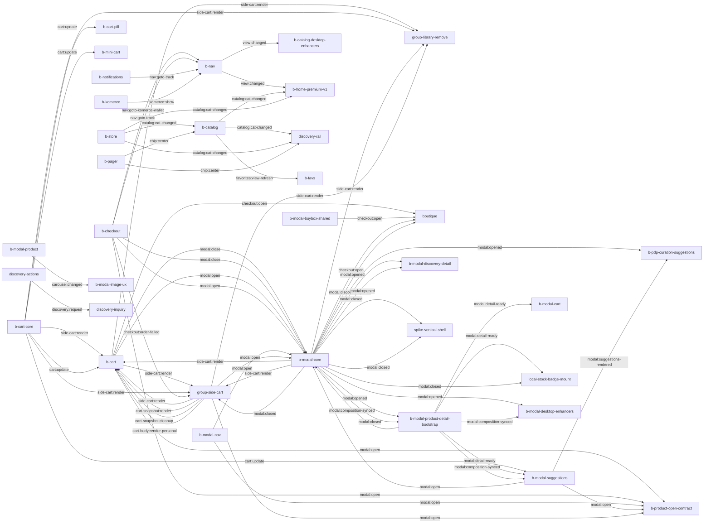

# Boutique 360 — carte d'architecture front (générée)

> ⚠️ Généré par `scripts/gen-boutique-360.js`. Ne pas éditer à la main.
> Régénéré le 2026-09-06T12:06:00.855Z.
> Couplage par **bus d'événements**. Couture backend par **endpoints → contrat OpenAPI**.

## Synthèse

- Modules JS : **103** (103 headés) · Événements bus : **24** · Bundles CSS : **5**
- Endpoints appelés : **62** — 🔴 0 hors contrat · ⚪ 43 non prouvés · 🔵 22 dynamiques
- Santé bus : 0 émission(s) orpheline(s), 0 écouteur(s) orphelin(s), 0 non déclaré(s)

## 1. Couture API → backend (résolue au contrat OpenAPI)

| Endpoint | Appelé par | Statut contrat |
|---|---|---|
| `/api/auth/login` | komerce-api | ⚪ non prouvé |
| `/api/auth/logout` | komerce-api | ⚪ non prouvé |
| `/api/auth/me` | b-greeting, b-komerce, komerce-api | ⚪ non prouvé |
| `/api/auth/me/documents` | b-komerce, b-tracking | ⚪ non prouvé |
| `/api/auth/me/notifications` | b-notifications | ⚪ non prouvé |
| `/api/auth/me/notifications/{id}/ack` | b-notifications | 🔵 dynamique |
| `/api/auth/me/pickup-authorization` | b-komerce | ⚪ non prouvé |
| `/api/auth/otp/request` | b-identity, b-tracking | ⚪ non prouvé |
| `/api/auth/otp/verify` | b-identity, b-tracking | ⚪ non prouvé |
| `/api/auth/passkey/credentials` | b-passkey-security | ⚪ non prouvé |
| `/api/auth/passkey/credentials/{id}` | b-passkey-security | 🔵 dynamique |
| `/api/auth/passkey/login/options` | b-passkey-login | ⚪ non prouvé |
| `/api/auth/passkey/login/verify` | b-passkey-login | ⚪ non prouvé |
| `/api/auth/passkey/register/options` | b-passkey-enrollment | ⚪ non prouvé |
| `/api/auth/passkey/register/verify` | b-passkey-enrollment | ⚪ non prouvé |
| `/api/auth/passkey/step-up/options` | b-passkey-step-up | ⚪ non prouvé |
| `/api/auth/passkey/step-up/verify` | b-passkey-step-up | ⚪ non prouvé |
| `/api/boutique/suggestions` | b-checkout, b-modal-core, discovery-api | 🔵 dynamique |
| `/api/carriers` | komerce-api | ⚪ non prouvé |
| `/api/carriers/{id}` | komerce-api | 🔵 dynamique |
| `/api/categories` | shop-schema | ⚪ non prouvé |
| `/api/client/tracking` | b-tracking | ⚪ non prouvé |
| `/api/health` | komerce-api | ⚪ non prouvé |
| `/api/hub/pack` | komerce-api | ⚪ non prouvé |
| `/api/hub/scan` | komerce-api | ⚪ non prouvé |
| `/api/hub/seal` | komerce-api | ⚪ non prouvé |
| `/api/local-stock/availability` | discovery-api | 🔵 dynamique |
| `/api/local-stock/checkout-preview` | b-checkout | ⚪ non prouvé |
| `/api/logistics/shipments` | komerce-api | ⚪ non prouvé |
| `/api/logistics/shipments/{id}` | komerce-api | 🔵 dynamique |
| `/api/orders` | b-checkout, b-tracking, komerce-api | ⚪ non prouvé |
| `/api/orders/{id}` | komerce-api | 🔵 dynamique |
| `/api/parcels` | komerce-api | ⚪ non prouvé |
| `/api/parcels/bootstrap/{id}` | komerce-api | 🔵 dynamique |
| `/api/parcels/optimize` | komerce-api | ⚪ non prouvé |
| `/api/parcels/{id}` | komerce-api | 🔵 dynamique |
| `/api/parcels/{id}/items` | komerce-api | 🔵 dynamique |
| `/api/payments/paypal/capture/{id}` | b-paypal | 🔵 dynamique |
| `/api/payments/paypal/create-order` | b-paypal | ⚪ non prouvé |
| `/api/payments/stripe/intent` | b-checkout | ⚪ non prouvé |
| `/api/products` | komerce-api | ⚪ non prouvé |
| `/api/products/{id}` | komerce-api | 🔵 dynamique |
| `/api/products/{id}/detail` | b-modal-product-detail-bootstrap | 🔵 dynamique |
| `/api/providers-services/inquiries` | providers-services-api | 🔵 dynamique |
| `/api/providers-services/physical-offers/{id}` | discovery-api | 🔵 dynamique |
| `/api/providers-services/services/{id}` | discovery-api | 🔵 dynamique |
| `/api/public/config` | b-checkout, b-paypal, b-utils | ⚪ non prouvé |
| `/api/purchasing/suppliers` | komerce-api | ⚪ non prouvé |
| `/api/purchasing/suppliers/{id}` | komerce-api | 🔵 dynamique |
| `/api/relais` | b-checkout | ⚪ non prouvé |
| `/api/relais/public` | b-nav | ⚪ non prouvé |
| `/api/scans` | komerce-api | ⚪ non prouvé |
| `/api/shared-carts/from-cart-items` | b-share-cart | ⚪ non prouvé |
| `/api/shared-carts/library` | group-api | ⚪ non prouvé |
| `/api/shared-carts/mine` | b-share-cart, group-api | ⚪ non prouvé |
| `/api/shared-carts/public/{id}` | b-group-banner, group-api | 🔵 dynamique |
| `/api/shared-carts/save` | group-api | ⚪ non prouvé |
| `/api/shared-carts/saved/{id}` | group-api | 🔵 dynamique |
| `/api/shared-carts/{id}/close` | group-api | 🔵 dynamique |
| `/api/shares` | b-cart, b-favs | 🔵 dynamique |
| `/api/wallet` | b-checkout, b-komerce, b-tracking, b-wallet | ⚪ non prouvé |
| `/api/wallet/transactions` | b-wallet | ⚪ non prouvé |

## 2. Topologie du bus

| Événement | Émetteurs | Écouteurs | Statut |
|---|---|---|---|
| `carousel:changed` | b-modal-product | b-modal-image-ux | 🟢 sain |
| `cart-body:render-personal` | group-side-cart | b-cart | 🟢 sain |
| `cart-snapshot:cleanup` | group-side-cart | b-cart | 🟢 sain |
| `cart-snapshot:render` | group-side-cart | b-cart | 🟢 sain |
| `cart:update` | b-cart-core | b-cart, b-cart-pill, b-mini-cart, b-modal-suggestions | 🟢 sain |
| `catalog:cat-changed` | b-catalog, b-store | b-catalog, b-home-premium-v1, discovery-rail | 🟢 sain |
| `checkout:open` | b-cart, b-modal-buybox-shared, b-modal-core | boutique | 🟢 sain |
| `checkout:order-failed` | b-checkout | group-side-cart | 🟢 sain |
| `chip:center` | b-pager | b-catalog, discovery-rail | 🟢 sain |
| `discovery:request` | discovery-actions | discovery-inquiry | 🟢 sain (propriétaire: catalog) |
| `favorites:view-refresh` | b-catalog | b-favs | 🟢 sain |
| `komerce:show` | b-komerce | b-nav | 🟢 sain |
| `modal:close` | b-cart, b-checkout | b-modal-core | 🟢 sain |
| `modal:closed` | b-modal-core | b-modal-discovery-detail, b-modal-product-detail-bootstrap, group-side-cart, local-stock-badge-mount, spike-vertical-shell | 🟢 sain (propriétaire: modal-product) |
| `modal:composition-synced` | b-modal-product-detail-bootstrap | b-modal-core, b-modal-desktop-enhancers, b-modal-suggestions | 🟢 sain (propriétaire: modal-product) |
| `modal:detail-ready` | b-modal-product-detail-bootstrap | b-modal-cart, b-modal-suggestions, local-stock-badge-mount | 🟢 sain |
| `modal:discovery-opened` | b-modal-core | b-modal-discovery-detail | 🟢 sain (propriétaire: catalog) |
| `modal:open` | b-cart, b-checkout, b-modal-nav, b-modal-suggestions, group-side-cart | b-modal-core, b-product-open-contract | 🟢 sain |
| `modal:opened` | b-modal-core | b-modal-desktop-enhancers, b-modal-product-detail-bootstrap, b-pdp-curation-suggestions, boutique, spike-vertical-shell | 🟢 sain (propriétaire: modal-product) |
| `modal:suggestions-rendered` | b-modal-suggestions | b-pdp-curation-suggestions | 🟢 sain |
| `nav:goto-komerce-wallet` | b-checkout | b-nav | 🟢 sain |
| `nav:goto-track` | b-checkout, b-notifications | b-nav | 🟢 sain |
| `side-cart:render` | b-cart, b-cart-core, b-modal-core, group-side-cart | b-cart, group-library-remove, group-side-cart | 🟢 sain |
| `view:changed` | b-nav | b-catalog-desktop-enhancers, b-home-premium-v1 | 🟢 sain |

### Diagramme

## 2b. Propriété des contrats bus (P3b)

> Uniquement les événements déclarés dans le bloc `Propriété des contrats` de
> `b-bus.js`. Plusieurs consommateurs déclarés ne sont **pas** une anomalie —
> seuls le sont : propriétaire absent, producteur non autorisé/absent, payload
> divergent, ou consommateur observé hors de la liste déclarée.

| Événement | Propriétaire | Producteur(s) | Consommateurs | Payload | Verdict |
|---|---|---|---|---|---|
| `modal:opened` | modal-product | b-modal-core | b-modal-desktop-enhancers, b-modal-product-detail-bootstrap, b-pdp-curation-suggestions, boutique, spike-vertical-shell | value | 🟢 propriété saine |
| `modal:discovery-opened` | catalog | b-modal-core | b-modal-discovery-detail | value | 🟢 propriété saine |
| `modal:closed` | modal-product | b-modal-core | b-modal-discovery-detail, b-modal-product-detail-bootstrap, group-side-cart, local-stock-badge-mount, spike-vertical-shell | none | 🟢 propriété saine |
| `modal:composition-synced` | modal-product | b-modal-product-detail-bootstrap | b-modal-core, b-modal-desktop-enhancers, b-modal-suggestions | none | 🟢 propriété saine |
| `discovery:request` | catalog | discovery-actions | discovery-inquiry | value | 🟢 propriété saine |

## 3. Bundles CSS

| Bundle | Sources |
|---|---|
| `css/dist/base.css` | `tokens`, `reset`, `layout`, `hero`, `hero-ultra-mobile`, `mobile-shell-convergence` |
| `css/dist/components.css` | `categories`, `category-cutout-navigation`, `products`, `product-image-loading`, `discovery-rail`, `spike-vertical-shell`, `modal-shell`, `modal-media`, `modal-product`, `modal-product-lot4-hybrid`, `modal-desktop-density`, `modal-mobile-canonical`, `modal-enriched-content`, `modal-cart-sku-guard`, `cart`, `interactions`, `modal-mobile-suggestion-actions`, `modal-product-polish`, `modal-suggestion-filter`, `modal-suggestion-card-polish`, `hero-cart-proxy`, `shared-list-side-cart`, `shared-list-side-cart-responsive`, `shared-list-library-remove`, `shared-list-lists-tab`, `identity`, `paypal`, `wallet`, `komerce`, `notifications`, `checkout-vertical-rail`, `mobile-catalog-convergence`, `mobile-cart-convergence` |
| `css/dist/desktop.css` | `boutique-desktop`, `side-cart-desktop-polish`, `category-cutout-navigation-desktop` |
| `css/dist/checkout-desktop-v2.css` | `checkout-desktop-v2` |
| `css/dist/discovery-desktop-v2.css` | `discovery-desktop-v2` |

---
*Carte vérifiée en pre-commit par `boutique:360:check` (cliquet bus + endpoints hors contrat).*
