# Dashboards 360 — carte d'architecture admin (générée)

> ⚠️ Fichier **généré** par `scripts/gen-dashboards-360.js`. Ne pas éditer à la main.
> Régénéré le 2026-08-14T14:07:24.626Z.
> Pendant front du graphe backend : les dashboards se couplent par la chaîne **route → vue → KmcApi → endpoint → contrat**, pas par un bus ni par les imports.

## Synthèse

- Modules JS : **40** (40 header complet, 0 lite, **0 sans header**)
- Routes SPA : **30**
- Méthodes `KmcApi` : **100** exportées, 98 appelées par au moins une vue
- Santé chaîne : 0 route(s) orpheline(s), 0 méthode(s) API morte(s), 0 méthode(s) API absente(s) (crash garanti), 0 violation(s) de doctrine
- Contrats non prouvés réellement appelés : **59** (signal de risque, cf. bug `getOps()`/`.orders`)

## 1. Routeur SPA → Vues

| Route | Vue | Shell | Rôles | Fichier trouvé |
|---|---|---|---|---|
| `/admin/pilotage` | PilotageView | ct | tous | ✅ |
| `/admin/sante` | SanteView | ct | tous | ✅ |
| `/admin/control-tower` | ControlTowerView | ct | tous | ✅ |
| `/admin/costing` | CostingView | ct | tous | ✅ |
| `/admin/orders-logistics` | OrdersLogisticsView | ct | tous | ✅ |
| `/admin/sales` | SalesView | ct | tous | ✅ |
| `/admin/economic` | EconomicView | ct | tous | ✅ |
| `/admin/pilotage-fin` | PilotageFinView | ct | tous | ✅ |
| `/admin/invoices` | InvoicesView | ct | tous | ✅ |
| `/admin/sourcing` | SourcingView | ct | admin, sourcing | ✅ |
| `/admin/sourcing-scanner` | SourcingScannerView | ct | admin, sourcing | ✅ |
| `/admin/pricing` | PricingView | ct | admin, sourcing, finance | ✅ |
| `/admin/pricing-workshop` | PricingWorkshopView | ct | admin | ✅ |
| `/admin/pricing-strategy` | PricingStrategyView | ct | admin, sourcing, finance | ✅ |
| `/admin/economic-flow` | EconomicFlowView | ct | admin, sourcing, finance | ✅ |
| `/admin/categories` | CategoriesView | ct | admin | ✅ |
| `/admin/products` | ProductsView | ct | admin | ✅ |
| `/admin/catalog-approval` | CatalogApprovalView | ct | admin | ✅ |
| `/admin/problems` | ProblemsView | bo | tous | ✅ |
| `/admin/alerts` | ActionCenterView | bo | tous | ✅ |
| `/admin/clients` | ClientsView | bo | admin, support, finance | ✅ |
| `/admin/hub-relais` | HubRelaisView | bo | admin, hub, relais | ✅ |
| `/admin/transitaire` | TransitaireView | bo | admin, hub | ✅ |
| `/admin/inventory` | InventoryView | bo | admin, hub | ✅ |
| `/admin/accounting` | AccountingView | bo | admin, finance | ✅ |
| `/admin/customs` | CustomsView | bo | admin, finance | ✅ |
| `/admin/suppliers` | SuppliersView | bo | admin, sourcing | ✅ |
| `/admin/settings` | SettingsView | bo | admin | ✅ |
| `/admin/simulator` | SimulatorView | bo | admin | ✅ |
| `/admin/shared-carts` | SharedCartsView | bo | admin, support | ✅ |

## 2. Chaîne Vue → KmcApi → Endpoint → Contrat

| Vue | Méthode appelée | Définie ? | Endpoint résolu | Statut contrat |
|---|---|---|---|---|
| AccountingView | `getCashReconciliation` | ✅ | `GET /api/cash/reconciliation` | ⚪ non prouvé |
| AccountingView | `getCashUncollected` | ✅ | `GET /api/cash/uncollected` | ⚪ non prouvé |
| AccountingView | `getEconomicCharges` | ✅ | `GET /api/admin/economic/charges` | ⚪ non prouvé |
| AccountingView | `getFinance` | ✅ | `GET /api/dashboard/finance` | ⚪ non prouvé |
| ActionCenterView | `acknowledgeSignal` | ✅ | `POST /api/admin/signals/…` | 🔵 url dynamique (non comparable) |
| ActionCenterView | `generateSignals` | ✅ | `POST /api/admin/signals/generate` | ⚪ non prouvé |
| ActionCenterView | `getSignalsList` | ✅ | `GET /api/admin/signals` | ⚪ non prouvé |
| ActionCenterView | `getSignalsStats` | ✅ | `GET /api/admin/signals/stats` | ⚪ non prouvé |
| ActionCenterView | `resolveSignal` | ✅ | `POST /api/admin/signals/…` | 🔵 url dynamique (non comparable) |
| ActionCenterView | `snoozeSignal` | ✅ | `POST /api/admin/signals/…` | 🔵 url dynamique (non comparable) |
| ClientsView | `getClientDetail` | ✅ | `GET /api/dashboard/clients/detail` | ⚪ non prouvé |
| ClientsView | `getClients` | ✅ | `GET /api/dashboard/clients` | ⚪ non prouvé |
| ClientsView | `getClientsList` | ✅ | `GET /api/dashboard/clients/list` | ⚪ non prouvé |
| ControlTowerView | `getControlTower` | ✅ | `GET /api/admin/dashboard/control-tower` | ⚪ non prouvé |
| ControlTowerView | `getOps` | ✅ | `GET /api/dashboard/ops` | ⚪ non prouvé |
| ControlTowerView | `getUnsoldStats` | ✅ | — | ❓ url non résolue |
| CostingView | `getCosting` | ✅ | `GET /api/admin/dashboard/costing` | ⚪ non prouvé |
| CostingView | `getCostingOrders` | ✅ | `GET /api/admin/costing/orders` | ⚪ non prouvé |
| CostingView | `getCostingProducts` | ✅ | `GET /api/admin/costing/products` | ⚪ non prouvé |
| CostingView | `getCostingRelais` | ✅ | `GET /api/admin/costing/relais` | ⚪ non prouvé |
| CustomsView | `createCustomsShipment` | ✅ | `POST /api/admin/customs-shipments` | ⚪ non prouvé |
| CustomsView | `getCustomsRatesEffective` | ✅ | `GET /api/admin/customs-shipments/rates/effective` | ⚪ non prouvé |
| CustomsView | `getCustomsShipment` | ✅ | `GET /api/admin/customs-shipments/…` | 🔵 url dynamique (non comparable) |
| CustomsView | `getCustomsShipments` | ✅ | `GET /api/admin/customs-shipments` | ⚪ non prouvé |
| CustomsView | `getPartnersLogistique` | ✅ | `GET /api/admin/partners` | ⚪ non prouvé |
| EconomicFlowView | `getPricingFlow` | ✅ | `POST /api/pricing/flow` | ⚪ non prouvé |
| EconomicFlowView | `getProducts` | ✅ | `GET /api/products` | ⚪ non prouvé |
| EconomicView | `getEconomicCharges` | ✅ | `GET /api/admin/economic/charges` | ⚪ non prouvé |
| EconomicView | `getEconomicCoherence` | ✅ | `GET /api/admin/economic/coherence` | ⚪ non prouvé |
| EconomicView | `getEconomicExecutive` | ✅ | `GET /api/admin/economic/executive` | ⚪ non prouvé |
| EconomicView | `getPricingDashboard` | ✅ | `GET /api/pricing/dashboard` | ⚪ non prouvé |
| HubRelaisView | `autoDistribute` | ✅ | `POST /api/hub/auto-distribute` | ⚪ non prouvé |
| HubRelaisView | `getDistribution` | ✅ | `GET /api/hub/auto-distribute` | ⚪ non prouvé |
| HubRelaisView | `getParcels` | ✅ | `GET /api/v2/parcels` | ⚪ non prouvé |
| HubRelaisView | `getPipeline` | ✅ | `GET /api/dashboard/pipeline` | ⚪ non prouvé |
| HubRelaisView | `hubMarkOrdered` | ✅ | `POST /api/hub/orders/mark-ordered` | ⚪ non prouvé |
| HubRelaisView | `hubShip` | ✅ | `POST /api/v2/parcels/…` | 🔵 url dynamique (non comparable) |
| HubRelaisView | `relaisCollect` | ✅ | `POST /api/v2/parcels/…` | 🔵 url dynamique (non comparable) |
| HubRelaisView | `relaisConfirmCash` | ✅ | `POST /api/v2/orders/…` | 🔵 url dynamique (non comparable) |
| HubRelaisView | `relaisReceive` | ✅ | `POST /api/v2/parcels/…` | 🔵 url dynamique (non comparable) |
| InventoryView | `getHubInventoryOpenParcels` | ✅ | `GET /api/hub/inventory/open-parcels` | ⚪ non prouvé |
| InventoryView | `getHubInventoryProposals` | ✅ | `GET /api/hub/inventory/proposals` | ⚪ non prouvé |
| InventoryView | `getHubInventoryStats` | ✅ | `GET /api/hub/inventory/stats` | ⚪ non prouvé |
| InventoryView | `hubInventoryProposeAll` | ✅ | `POST /api/hub/inventory/propose-all` | ⚪ non prouvé |
| InventoryView | `hubInventoryScanAssign` | ✅ | `POST /api/hub/inventory/scan-assign` | ⚪ non prouvé |
| InvoicesView | `getCashReconciliation` | ✅ | `GET /api/cash/reconciliation` | ⚪ non prouvé |
| InvoicesView | `getCashUncollected` | ✅ | `GET /api/cash/uncollected` | ⚪ non prouvé |
| InvoicesView | `getInvoices` | ✅ | `GET /api/invoices` | ⚪ non prouvé |
| OrdersLogisticsView | `getLogistics` | ✅ | `GET /api/admin/dashboard/logistics` | ⚪ non prouvé |
| OrdersLogisticsView | `getOrders` | ✅ | `GET /api/orders` | ⚪ non prouvé |
| PilotageFinView | `getEconomicHistory` | ✅ | `GET /api/admin/economic/history` | ⚪ non prouvé |
| PilotageFinView | `getEconomicVariables` | ✅ | `GET /api/admin/economic/variables` | ⚪ non prouvé |
| PilotageFinView | `getFinance` | ✅ | `GET /api/dashboard/finance` | ⚪ non prouvé |
| PilotageView | `getUnified` | ✅ | `GET /api/admin/dashboard/unified` | ⚪ non prouvé |
| PricingStrategyView | `applyPricingStrategy` | ✅ | `POST /api/pricing/strategy/apply` | ⚪ non prouvé |
| PricingStrategyView | `createPricingCompetitor` | ✅ | `POST /api/pricing/strategy/competitors` | ⚪ non prouvé |
| PricingStrategyView | `deletePricingCompetitor` | ✅ | `DELETE /api/pricing/strategy/competitors/…` | 🔵 url dynamique (non comparable) |
| PricingStrategyView | `getPricingStrategy` | ✅ | `GET /api/pricing/strategy` | ⚪ non prouvé |
| PricingStrategyView | `getProducts` | ✅ | `GET /api/products` | ⚪ non prouvé |
| ProblemsView | `getOrders` | ✅ | `GET /api/orders` | ⚪ non prouvé |
| ProblemsView | `getParcelReconciliation` | ✅ | `GET /api/v2/parcels/reconciliation` | ⚪ non prouvé |
| SalesView | `getSales` | ✅ | `GET /api/dashboard/sales` | ⚪ non prouvé |
| SanteView | `getCashReconciliation` | ✅ | `GET /api/cash/reconciliation` | ⚪ non prouvé |
| SanteView | `getCashUncollected` | ✅ | `GET /api/cash/uncollected` | ⚪ non prouvé |
| SanteView | `getClients` | ✅ | `GET /api/dashboard/clients` | ⚪ non prouvé |
| SanteView | `getCustomsRatesEffective` | ✅ | `GET /api/admin/customs-shipments/rates/effective` | ⚪ non prouvé |
| SanteView | `getFinance` | ✅ | `GET /api/dashboard/finance` | ⚪ non prouvé |
| SanteView | `getFinanceConfig` | ✅ | `GET /api/admin/finance-config` | ⚪ non prouvé |
| SanteView | `getOps` | ✅ | `GET /api/dashboard/ops` | ⚪ non prouvé |
| SanteView | `getSales` | ✅ | `GET /api/dashboard/sales` | ⚪ non prouvé |
| SettingsView | `getSettingRule` | ✅ | — | ❓ url non résolue |
| SettingsView | `getSettings` | ✅ | — | ❓ url non résolue |
| SettingsView | `getSettingsAudit` | ✅ | — | ❓ url non résolue |
| SettingsView | `getSettingsDims` | ✅ | — | ❓ url non résolue |
| SettingsView | `getSettingsTaxes` | ✅ | — | ❓ url non résolue |
| SettingsView | `patchSettingRule` | ✅ | — | ❓ url non résolue |
| SettingsView | `putSettingsDims` | ✅ | — | ❓ url non résolue |
| SettingsView | `putSettingsTaxes` | ✅ | — | ❓ url non résolue |
| SettingsView | `resetSettingRule` | ✅ | — | ❓ url non résolue |
| SharedCartsView | `expireSharedCart` | ✅ | — | ❓ url non résolue |
| SharedCartsView | `extendSharedCart` | ✅ | — | ❓ url non résolue |
| SharedCartsView | `getSharedCart` | ✅ | — | ❓ url non résolue |
| SharedCartsView | `getSharedCarts` | ✅ | — | ❓ url non résolue |
| SharedCartsView | `noteSharedCart` | ✅ | — | ❓ url non résolue |
| SimulatorView | `simCleanup` | ✅ | — | ❓ url non résolue |
| SimulatorView | `simJournal` | ✅ | — | ❓ url non résolue |
| SimulatorView | `simStart` | ✅ | — | ❓ url non résolue |
| SimulatorView | `simStatus` | ✅ | — | ❓ url non résolue |
| SimulatorView | `simStop` | ✅ | — | ❓ url non résolue |
| SourcingScannerView | `getCustomsCategories` | ✅ | `GET /api/admin/customs-categories` | ⚪ non prouvé |
| SourcingScannerView | `getSourcingCandidate` | ✅ | `GET /api/admin/sourcing/candidates/…` | 🔵 url dynamique (non comparable) |
| SourcingScannerView | `getSourcingCandidates` | ✅ | `GET /api/admin/sourcing/candidates` | ⚪ non prouvé |
| SourcingScannerView | `getSourcingCatalogs` | ✅ | `GET /api/admin/sourcing/catalogs` | ⚪ non prouvé |
| SourcingScannerView | `importSourcingCatalog` | ✅ | `POST /api/admin/sourcing/catalogs/import` | ⚪ non prouvé |
| SourcingScannerView | `importSourcingProduct` | ✅ | `POST /api/admin/sourcing/candidates/…` | 🔵 url dynamique (non comparable) |
| SourcingScannerView | `rejectSourcingCandidate` | ✅ | `POST /api/admin/sourcing/candidates/…` | 🔵 url dynamique (non comparable) |
| SourcingScannerView | `scanSourcingCandidate` | ✅ | `POST /api/admin/sourcing/candidates/…` | 🔵 url dynamique (non comparable) |
| SourcingScannerView | `updateSourcingCandidate` | ✅ | `PUT /api/admin/sourcing/candidates/…` | 🔵 url dynamique (non comparable) |
| SourcingScannerView | `watchlistSourcingCandidate` | ✅ | `POST /api/admin/sourcing/candidates/…` | 🔵 url dynamique (non comparable) |
| SourcingView | `getSourcingAnalysis` | ✅ | `GET /api/admin/sourcing/analysis` | ⚪ non prouvé |
| SourcingView | `getSourcingSynthesis` | ✅ | `GET /api/admin/sourcing/synthesis` | ⚪ non prouvé |
| SourcingView | `updateSourcingProduct` | ✅ | `PUT /api/admin/sourcing/products/…` | 🔵 url dynamique (non comparable) |
| SuppliersView | `createPartner` | ✅ | `POST /api/admin/partners` | ⚪ non prouvé |
| SuppliersView | `deletePartner` | ✅ | `DELETE /api/admin/partners/…` | 🔵 url dynamique (non comparable) |
| SuppliersView | `getPartners` | ✅ | `GET /api/admin/partners` | ⚪ non prouvé |
| SuppliersView | `getPartnersStats` | ✅ | `GET /api/admin/partners/stats` | ⚪ non prouvé |
| SuppliersView | `updatePartner` | ✅ | `PUT /api/admin/partners/…` | 🔵 url dynamique (non comparable) |
| TransitaireView | `getTransitaireHistory` | ✅ | `GET /api/transitaire/history` | ⚪ non prouvé |
| TransitaireView | `getTransitaireParcels` | ✅ | `GET /api/transitaire/parcels` | ⚪ non prouvé |
| TransitaireView | `getTransitaireStats` | ✅ | `GET /api/transitaire/stats` | ⚪ non prouvé |
| TransitaireView | `shipTransitaireParcel` | ✅ | `POST /api/transitaire/ship` | ⚪ non prouvé |

### Diagramme

```mermaid
graph LR
  _admin_pilotage["/admin/pilotage"] --> PilotageView["PilotageView"]
  _admin_sante["/admin/sante"] --> SanteView["SanteView"]
  _admin_control_tower["/admin/control-tower"] --> ControlTowerView["ControlTowerView"]
  _admin_costing["/admin/costing"] --> CostingView["CostingView"]
  _admin_orders_logistics["/admin/orders-logistics"] --> OrdersLogisticsView["OrdersLogisticsView"]
  _admin_sales["/admin/sales"] --> SalesView["SalesView"]
  _admin_economic["/admin/economic"] --> EconomicView["EconomicView"]
  _admin_pilotage_fin["/admin/pilotage-fin"] --> PilotageFinView["PilotageFinView"]
  _admin_invoices["/admin/invoices"] --> InvoicesView["InvoicesView"]
  _admin_sourcing["/admin/sourcing"] --> SourcingView["SourcingView"]
  _admin_sourcing_scanner["/admin/sourcing-scanner"] --> SourcingScannerView["SourcingScannerView"]
  _admin_pricing["/admin/pricing"] --> PricingView["PricingView"]
  _admin_pricing_workshop["/admin/pricing-workshop"] --> PricingWorkshopView["PricingWorkshopView"]
  _admin_pricing_strategy["/admin/pricing-strategy"] --> PricingStrategyView["PricingStrategyView"]
  _admin_economic_flow["/admin/economic-flow"] --> EconomicFlowView["EconomicFlowView"]
  _admin_categories["/admin/categories"] --> CategoriesView["CategoriesView"]
  _admin_products["/admin/products"] --> ProductsView["ProductsView"]
  _admin_catalog_approval["/admin/catalog-approval"] --> CatalogApprovalView["CatalogApprovalView"]
  _admin_problems["/admin/problems"] --> ProblemsView["ProblemsView"]
  _admin_alerts["/admin/alerts"] --> ActionCenterView["ActionCenterView"]
  _admin_clients["/admin/clients"] --> ClientsView["ClientsView"]
  _admin_hub_relais["/admin/hub-relais"] --> HubRelaisView["HubRelaisView"]
  _admin_transitaire["/admin/transitaire"] --> TransitaireView["TransitaireView"]
  _admin_inventory["/admin/inventory"] --> InventoryView["InventoryView"]
  _admin_accounting["/admin/accounting"] --> AccountingView["AccountingView"]
  _admin_customs["/admin/customs"] --> CustomsView["CustomsView"]
  _admin_suppliers["/admin/suppliers"] --> SuppliersView["SuppliersView"]
  _admin_settings["/admin/settings"] --> SettingsView["SettingsView"]
  _admin_simulator["/admin/simulator"] --> SimulatorView["SimulatorView"]
  _admin_shared_carts["/admin/shared-carts"] --> SharedCartsView["SharedCartsView"]
  AccountingView -->|getFinance❓| _api_dashboard_finance["/api/dashboard/finance"]
  AccountingView -->|getEconomicCharges❓| _api_admin_economic_charges["/api/admin/economic/charges"]
  AccountingView -->|getCashReconciliation❓| _api_cash_reconciliation["/api/cash/reconciliation"]
  AccountingView -->|getCashUncollected❓| _api_cash_uncollected["/api/cash/uncollected"]
  ActionCenterView -->|getSignalsStats❓| _api_admin_signals_stats["/api/admin/signals/stats"]
  ActionCenterView -->|getSignalsList❓| _api_admin_signals["/api/admin/signals"]
  ActionCenterView -->|acknowledgeSignal| _api_admin_signals["/api/admin/signals"]
  ActionCenterView -->|snoozeSignal| _api_admin_signals["/api/admin/signals"]
  ActionCenterView -->|resolveSignal| _api_admin_signals["/api/admin/signals"]
  ActionCenterView -->|generateSignals❓| _api_admin_signals_generate["/api/admin/signals/generate"]
  ClientsView -->|getClients❓| _api_dashboard_clients["/api/dashboard/clients"]
  ClientsView -->|getClientsList❓| _api_dashboard_clients_list["/api/dashboard/clients/list"]
  ClientsView -->|getClientDetail❓| _api_dashboard_clients_detail["/api/dashboard/clients/detail"]
  ControlTowerView -->|getControlTower❓| _api_admin_dashboard_control_tower["/api/admin/dashboard/control-tower"]
  ControlTowerView -->|getOps❓| _api_dashboard_ops["/api/dashboard/ops"]
  CostingView -->|getCosting❓| _api_admin_dashboard_costing["/api/admin/dashboard/costing"]
  CostingView -->|getCostingOrders❓| _api_admin_costing_orders["/api/admin/costing/orders"]
  CostingView -->|getCostingProducts❓| _api_admin_costing_products["/api/admin/costing/products"]
  CostingView -->|getCostingRelais❓| _api_admin_costing_relais["/api/admin/costing/relais"]
  CustomsView -->|getCustomsShipments❓| _api_admin_customs_shipments["/api/admin/customs-shipments"]
  CustomsView -->|getCustomsRatesEffective❓| _api_admin_customs_shipments_rates_effective["/api/admin/customs-shipments/rates/effective"]
  CustomsView -->|getPartnersLogistique❓| _api_admin_partners["/api/admin/partners"]
  CustomsView -->|createCustomsShipment❓| _api_admin_customs_shipments["/api/admin/customs-shipments"]
  CustomsView -->|getCustomsShipment| _api_admin_customs_shipments["/api/admin/customs-shipments"]
  EconomicFlowView -->|getProducts❓| _api_products["/api/products"]
  EconomicFlowView -->|getPricingFlow❓| _api_pricing_flow["/api/pricing/flow"]
  EconomicView -->|getPricingDashboard❓| _api_pricing_dashboard["/api/pricing/dashboard"]
  EconomicView -->|getEconomicExecutive❓| _api_admin_economic_executive["/api/admin/economic/executive"]
  EconomicView -->|getEconomicCharges❓| _api_admin_economic_charges["/api/admin/economic/charges"]
  EconomicView -->|getEconomicCoherence❓| _api_admin_economic_coherence["/api/admin/economic/coherence"]
  HubRelaisView -->|getPipeline❓| _api_dashboard_pipeline["/api/dashboard/pipeline"]
  HubRelaisView -->|getParcels❓| _api_v2_parcels["/api/v2/parcels"]
  HubRelaisView -->|hubMarkOrdered❓| _api_hub_orders_mark_ordered["/api/hub/orders/mark-ordered"]
  HubRelaisView -->|hubShip| _api_v2_parcels["/api/v2/parcels"]
  HubRelaisView -->|autoDistribute❓| _api_hub_auto_distribute["/api/hub/auto-distribute"]
  HubRelaisView -->|getDistribution❓| _api_hub_auto_distribute["/api/hub/auto-distribute"]
  HubRelaisView -->|relaisConfirmCash| _api_v2_orders["/api/v2/orders"]
  HubRelaisView -->|relaisReceive| _api_v2_parcels["/api/v2/parcels"]
  HubRelaisView -->|relaisCollect| _api_v2_parcels["/api/v2/parcels"]
  InventoryView -->|hubInventoryScanAssign❓| _api_hub_inventory_scan_assign["/api/hub/inventory/scan-assign"]
  InventoryView -->|getHubInventoryStats❓| _api_hub_inventory_stats["/api/hub/inventory/stats"]
  InventoryView -->|getHubInventoryProposals❓| _api_hub_inventory_proposals["/api/hub/inventory/proposals"]
  InventoryView -->|getHubInventoryOpenParcels❓| _api_hub_inventory_open_parcels["/api/hub/inventory/open-parcels"]
  InventoryView -->|hubInventoryProposeAll❓| _api_hub_inventory_propose_all["/api/hub/inventory/propose-all"]
  InvoicesView -->|getInvoices❓| _api_invoices["/api/invoices"]
  InvoicesView -->|getCashReconciliation❓| _api_cash_reconciliation["/api/cash/reconciliation"]
  InvoicesView -->|getCashUncollected❓| _api_cash_uncollected["/api/cash/uncollected"]
  OrdersLogisticsView -->|getLogistics❓| _api_admin_dashboard_logistics["/api/admin/dashboard/logistics"]
  OrdersLogisticsView -->|getOrders❓| _api_orders["/api/orders"]
  PilotageFinView -->|getFinance❓| _api_dashboard_finance["/api/dashboard/finance"]
  PilotageFinView -->|getEconomicHistory❓| _api_admin_economic_history["/api/admin/economic/history"]
  PilotageFinView -->|getEconomicVariables❓| _api_admin_economic_variables["/api/admin/economic/variables"]
  PilotageView -->|getUnified❓| _api_admin_dashboard_unified["/api/admin/dashboard/unified"]
  PricingStrategyView -->|getProducts❓| _api_products["/api/products"]
  PricingStrategyView -->|getPricingStrategy❓| _api_pricing_strategy["/api/pricing/strategy"]
  PricingStrategyView -->|createPricingCompetitor❓| _api_pricing_strategy_competitors["/api/pricing/strategy/competitors"]
  PricingStrategyView -->|deletePricingCompetitor| _api_pricing_strategy_competitors["/api/pricing/strategy/competitors"]
  PricingStrategyView -->|applyPricingStrategy❓| _api_pricing_strategy_apply["/api/pricing/strategy/apply"]
  ProblemsView -->|getOrders❓| _api_orders["/api/orders"]
  ProblemsView -->|getParcelReconciliation❓| _api_v2_parcels_reconciliation["/api/v2/parcels/reconciliation"]
  SalesView -->|getSales❓| _api_dashboard_sales["/api/dashboard/sales"]
  SanteView -->|getOps❓| _api_dashboard_ops["/api/dashboard/ops"]
  SanteView -->|getFinance❓| _api_dashboard_finance["/api/dashboard/finance"]
  SanteView -->|getClients❓| _api_dashboard_clients["/api/dashboard/clients"]
  SanteView -->|getSales❓| _api_dashboard_sales["/api/dashboard/sales"]
  SanteView -->|getCashReconciliation❓| _api_cash_reconciliation["/api/cash/reconciliation"]
  SanteView -->|getCashUncollected❓| _api_cash_uncollected["/api/cash/uncollected"]
  SanteView -->|getCustomsRatesEffective❓| _api_admin_customs_shipments_rates_effective["/api/admin/customs-shipments/rates/effective"]
  SanteView -->|getFinanceConfig❓| _api_admin_finance_config["/api/admin/finance-config"]
  SourcingScannerView -->|getSourcingCatalogs❓| _api_admin_sourcing_catalogs["/api/admin/sourcing/catalogs"]
  SourcingScannerView -->|getSourcingCandidates❓| _api_admin_sourcing_candidates["/api/admin/sourcing/candidates"]
  SourcingScannerView -->|getCustomsCategories❓| _api_admin_customs_categories["/api/admin/customs-categories"]
  SourcingScannerView -->|importSourcingCatalog❓| _api_admin_sourcing_catalogs_import["/api/admin/sourcing/catalogs/import"]
  SourcingScannerView -->|getSourcingCandidate| _api_admin_sourcing_candidates["/api/admin/sourcing/candidates"]
  SourcingScannerView -->|updateSourcingCandidate| _api_admin_sourcing_candidates["/api/admin/sourcing/candidates"]
  SourcingScannerView -->|scanSourcingCandidate| _api_admin_sourcing_candidates["/api/admin/sourcing/candidates"]
  SourcingScannerView -->|importSourcingProduct| _api_admin_sourcing_candidates["/api/admin/sourcing/candidates"]
  SourcingScannerView -->|watchlistSourcingCandidate| _api_admin_sourcing_candidates["/api/admin/sourcing/candidates"]
  SourcingScannerView -->|rejectSourcingCandidate| _api_admin_sourcing_candidates["/api/admin/sourcing/candidates"]
  SourcingView -->|getSourcingSynthesis❓| _api_admin_sourcing_synthesis["/api/admin/sourcing/synthesis"]
  SourcingView -->|getSourcingAnalysis❓| _api_admin_sourcing_analysis["/api/admin/sourcing/analysis"]
  SourcingView -->|updateSourcingProduct| _api_admin_sourcing_products["/api/admin/sourcing/products"]
  SuppliersView -->|getPartners❓| _api_admin_partners["/api/admin/partners"]
  SuppliersView -->|getPartnersStats❓| _api_admin_partners_stats["/api/admin/partners/stats"]
  SuppliersView -->|updatePartner| _api_admin_partners["/api/admin/partners"]
  SuppliersView -->|createPartner❓| _api_admin_partners["/api/admin/partners"]
  SuppliersView -->|deletePartner| _api_admin_partners["/api/admin/partners"]
  TransitaireView -->|shipTransitaireParcel❓| _api_transitaire_ship["/api/transitaire/ship"]
  TransitaireView -->|getTransitaireStats❓| _api_transitaire_stats["/api/transitaire/stats"]
  TransitaireView -->|getTransitaireParcels❓| _api_transitaire_parcels["/api/transitaire/parcels"]
  TransitaireView -->|getTransitaireHistory❓| _api_transitaire_history["/api/transitaire/history"]
```

## 4. Signaux informatifs (non bloquants)

- ⚪ **Contrats appelés mais non prouvés** (`UNKNOWN` dans openapi.json — aucun test d'intégration ne couvre la forme de réponse) : `GET /api/admin/costing/orders`, `GET /api/admin/costing/products`, `GET /api/admin/costing/relais`, `GET /api/admin/customs-categories`, `GET /api/admin/customs-shipments`, `GET /api/admin/customs-shipments/rates/effective`, `GET /api/admin/dashboard/control-tower`, `GET /api/admin/dashboard/costing`, `GET /api/admin/dashboard/logistics`, `GET /api/admin/dashboard/unified`, `GET /api/admin/economic/charges`, `GET /api/admin/economic/coherence`, `GET /api/admin/economic/executive`, `GET /api/admin/economic/history`, `GET /api/admin/economic/variables`, `GET /api/admin/finance-config`, `GET /api/admin/partners`, `GET /api/admin/partners/stats`, `GET /api/admin/signals`, `GET /api/admin/signals/stats`, `GET /api/admin/sourcing/analysis`, `GET /api/admin/sourcing/candidates`, `GET /api/admin/sourcing/catalogs`, `GET /api/admin/sourcing/synthesis`, `GET /api/cash/reconciliation`, `GET /api/cash/uncollected`, `GET /api/dashboard/clients`, `GET /api/dashboard/clients/detail`, `GET /api/dashboard/clients/list`, `GET /api/dashboard/finance`, `GET /api/dashboard/ops`, `GET /api/dashboard/pipeline`, `GET /api/dashboard/sales`, `GET /api/hub/auto-distribute`, `GET /api/hub/inventory/open-parcels`, `GET /api/hub/inventory/proposals`, `GET /api/hub/inventory/stats`, `GET /api/invoices`, `GET /api/orders`, `GET /api/pricing/dashboard`, `GET /api/pricing/strategy`, `GET /api/products`, `GET /api/transitaire/history`, `GET /api/transitaire/parcels`, `GET /api/transitaire/stats`, `GET /api/v2/parcels`, `GET /api/v2/parcels/reconciliation`, `POST /api/admin/customs-shipments`, `POST /api/admin/partners`, `POST /api/admin/signals/generate`, `POST /api/admin/sourcing/catalogs/import`, `POST /api/hub/auto-distribute`, `POST /api/hub/inventory/propose-all`, `POST /api/hub/inventory/scan-assign`, `POST /api/hub/orders/mark-ordered`, `POST /api/pricing/flow`, `POST /api/pricing/strategy/apply`, `POST /api/pricing/strategy/competitors`, `POST /api/transitaire/ship`
- 🔵 **URLs construites dynamiquement** (segment avec id/paramètre concaténé — non comparables au contrat tel quel, à vérifier à la main si besoin) : `acknowledgeSignal (préfixe: POST /api/admin/signals/…)`, `deletePartner (préfixe: DELETE /api/admin/partners/…)`, `deletePricingCompetitor (préfixe: DELETE /api/pricing/strategy/competitors/…)`, `getCustomsShipment (préfixe: GET /api/admin/customs-shipments/…)`, `getSourcingCandidate (préfixe: GET /api/admin/sourcing/candidates/…)`, `hubShip (préfixe: POST /api/v2/parcels/…)`, `importSourcingProduct (préfixe: POST /api/admin/sourcing/candidates/…)`, `rejectSourcingCandidate (préfixe: POST /api/admin/sourcing/candidates/…)`, `relaisCollect (préfixe: POST /api/v2/parcels/…)`, `relaisConfirmCash (préfixe: POST /api/v2/orders/…)`, `relaisReceive (préfixe: POST /api/v2/parcels/…)`, `resolveSignal (préfixe: POST /api/admin/signals/…)`, `scanSourcingCandidate (préfixe: POST /api/admin/sourcing/candidates/…)`, `snoozeSignal (préfixe: POST /api/admin/signals/…)`, `updatePartner (préfixe: PUT /api/admin/partners/…)`, `updateSourcingCandidate (préfixe: PUT /api/admin/sourcing/candidates/…)`, `updateSourcingProduct (préfixe: PUT /api/admin/sourcing/products/…)`, `watchlistSourcingCandidate (préfixe: POST /api/admin/sourcing/candidates/…)`
- ❓ **Méthodes API dont l'URL n'a pas pu être résolue statiquement** (à vérifier à la main) : `expireSharedCart`, `extendSharedCart`, `getSettingRule`, `getSettings`, `getSettingsAudit`, `getSettingsDims`, `getSettingsTaxes`, `getSharedCart`, `getSharedCarts`, `getUnsoldStats`, `noteSharedCart`, `patchSettingRule`, `putSettingsDims`, `putSettingsTaxes`, `resetSettingRule`, `simCleanup`, `simJournal`, `simStart`, `simStatus`, `simStop`

## 5. Couverture des headers

Complet : **40** · Lite : **0** · Sans header : **0**

## 6. Modules par domaine

### admin-dashboard

| Module | Rôle | Couche | Criticité | Doctrine |
|---|---|---|---|---|
| `api-client-unsold.js` | unsold-stats-api-patch | api-client | — | — |
| `api-client.js` | admin-dashboard-api-client | api-client | critical | kmc_api_only |
| `app.js` | admin-spa-entrypoint | entrypoint | critical | kmc_api_only |
| `ClientsView.js` | clients-view-root-legacy | ui-page | — | — |
| `components/Charts.js` | admin-chart-components | ui-component | medium | none |
| `components/KpiCard.js` | admin-kpi-card-component | ui-component | medium | none |
| `components/UI.js` | admin-alert-ui-component | ui-component | low | none |
| `filters-store.js` | admin-filter-state-store | state-store | high | kmc_api_only |
| `product-card-model.admin.js` | admin-product-card-view-model | view-model | medium | none |
| `utils.js` | admin-xss-escape-helpers | ui-renderer | medium | none |
| `views/AccountingView.js` | admin-accounting-view | ui-page | high | kmc_api_only |
| `views/ActionCenterView.js` | admin-action-center-view | ui-page | high | kmc_api_only |
| `views/CatalogApprovalView.js` | admin-catalog-approval-view | ui-page | high | kmc_api_only |
| `views/CategoriesView.js` | admin-categories-view | ui-page | medium | kmc_api_only |
| `views/ClientsView.js` | admin-clients-view | ui-page | medium | kmc_api_only |
| `views/ControlTowerView.js` | admin-control-tower-view | ui-page | high | kmc_api_only |
| `views/CostingView.js` | admin-costing-view | ui-page | medium | kmc_api_only |
| `views/CustomsView.js` | admin-customs-view | ui-page | high | kmc_api_only |
| `views/EconomicFlowView.js` | admin-economic-flow-view | ui-page | medium | kmc_api_only |
| `views/EconomicView.js` | admin-economic-view | ui-page | high | kmc_api_only |
| `views/HubRelaisView.js` | admin-hub-relais-view | ui-page | high | kmc_api_only |
| `views/InventoryView.js` | admin-inventory-view | ui-page | medium | kmc_api_only |
| `views/InvoicesView.js` | admin-invoices-view | ui-page | high | kmc_api_only |
| `views/OrdersLogisticsView.js` | admin-orders-logistics-view | ui-page | high | kmc_api_only |
| `views/PilotageFinView.js` | admin-pilotage-fin-view | ui-page | medium | kmc_api_only |
| `views/PilotageView.js` | admin-pilotage-view | ui-page | high | kmc_api_only |
| `views/PricingStrategyView.js` | admin-pricing-strategy-view | ui-page | high | kmc_api_only |
| `views/PricingView.js` | admin-pricing-view | ui-page | high | kmc_api_only |
| `views/PricingWorkshopView.js` | admin-pricing-workshop-view | ui-page | medium | kmc_api_only |
| `views/ProblemsView.js` | admin-problems-view | ui-page | high | kmc_api_only |
| `views/ProductsView.js` | admin-products-view | ui-page | medium | kmc_api_only |
| `views/SalesView.js` | admin-sales-view | ui-page | medium | kmc_api_only |
| `views/SanteView.js` | admin-sante-view | ui-page | high | kmc_api_only |
| `views/SettingsView.js` | admin-settings-view | ui-page | medium | kmc_api_only |
| `views/SharedCartsView.js` | admin-shared-carts-view | ui-page | high | kmc_api_only |
| `views/SimulatorView.js` | admin-simulator-view | ui-page | low | kmc_api_only |
| `views/SourcingScannerView.js` | admin-sourcing-scanner-view | ui-page | medium | kmc_api_only |
| `views/SourcingView.js` | admin-sourcing-view | ui-page | medium | kmc_api_only |
| `views/SuppliersView.js` | admin-suppliers-view | ui-page | medium | kmc_api_only |
| `views/TransitaireView.js` | admin-transitaire-view | ui-page | medium | kmc_api_only |

---
*Carte vérifiée en pre-commit par `check:dashboards-360` (cliquet sur les anomalies bloquantes ; les signaux informatifs ne bloquent jamais).*
