# Méta-graphe des coutures — les 3 territoires

> ⚠️ Généré par `scripts/gen-meta-graph.js`. Ne pas éditer à la main.
> Régénéré le 2026-06-20T13:17:57.811Z.
> Clé de voûte : le contrat OpenAPI. Chaque endpoint consommé est remonté
> jusqu'à sa route backend → services → tables (`x-route-file`).

## Sources cousues

- Backend : **654** nœuds · Contrat : **192** endpoints
- Boutique : **70** modules, 58 endpoints
- Dashboards : **40** modules, 111 arêtes d'appel

## Synthèse des coutures

- Endpoints consommés par au moins un front : **89**
- 🔗 Endpoints **partagés** (boutique + dashboards) : **2** — rayon de casse amplifié
- 🔴 Coutures **fantômes** (front → hors contrat) : **8**
- ⚠️ Tables touchées par **les deux** fronts : **6**

## 1. Endpoints partagés — toucher = casse double

| Endpoint | Route backend | Boutique | Dashboards | Tables |
|---|---|---|---|---|
| `/api/orders` | `routes/orders.js` | b-checkout, b-tracking, komerce-api | OrdersLogisticsView, ProblemsView | — |
| `/api/products` | `routes/products.js` | komerce-api | EconomicFlowView, PricingStrategyView | `product_variants`, `products` |

## 2. Coutures fantômes (à trancher)

Endpoints appelés par un front mais absents du contrat backend — route legacy non nettoyée, ou bug qui couve (classe `.orders` / `getCosting`).

| Endpoint | Appelé par |
|---|---|
| `/api/admin/dashboard/costing` ❌ | dashboards:CostingView |
| `/api/admin/dashboard/event-workspaces` ❌ | dashboards:EventWorkspacesView |
| `/api/admin/dashboard/unified` ❌ | dashboards:PilotageView |
| `/api/boutique/suggestions` ❌ | boutique:b-modal-core |
| `/api/collective-workspaces` ❌ | boutique:b-cart-groups-tab |
| `/api/dashboard/pipeline` ❌ | dashboards:HubRelaisView |
| `/api/pricing/flow` ❌ | dashboards:EconomicFlowView |
| `/api/v2/scan` ❌ | dashboards:HubRelaisView |

## 3. Tables à rayon de casse maximal (lues/écrites pour les 2 fronts)

| Table | Routes | Modules boutique | Vues dashboards |
|---|---|---|---|
| `orders` | 10 | 3 | 5 |
| `parcel_items` | 2 | 1 | 2 |
| `parcels` | 4 | 1 | 2 |
| `product_variants` | 1 | 1 | 2 |
| `products` | 5 | 3 | 3 |
| `users` | 7 | 5 | 5 |

## 4. Carte des coutures (partagés + fantômes)

```mermaid
graph TD
  subgraph FRONTS
    direction LR
  end
  ep__api_orders["/api/orders"] --> rt_routes_orders_js["routes/orders.js"]
  BTQ((boutique)) -->|3| ep__api_orders
  DASH((dashboards)) -->|2| ep__api_orders
  ep__api_products["/api/products"] --> rt_routes_products_js["routes/products.js"]
  BTQ((boutique)) -->|1| ep__api_products
  DASH((dashboards)) -->|2| ep__api_products
  ep__api_admin_dashboard_costing["/api/admin/dashboard/costing ❌"]:::phantom
  DASH((dashboards)) -->|1| ep__api_admin_dashboard_costing
  ep__api_admin_dashboard_event_workspaces["/api/admin/dashboard/event-workspaces ❌"]:::phantom
  DASH((dashboards)) -->|1| ep__api_admin_dashboard_event_workspaces
  ep__api_admin_dashboard_unified["/api/admin/dashboard/unified ❌"]:::phantom
  DASH((dashboards)) -->|1| ep__api_admin_dashboard_unified
  ep__api_boutique_suggestions["/api/boutique/suggestions ❌"]:::phantom
  BTQ((boutique)) -->|1| ep__api_boutique_suggestions
  ep__api_collective_workspaces["/api/collective-workspaces ❌"]:::phantom
  BTQ((boutique)) -->|1| ep__api_collective_workspaces
  ep__api_dashboard_pipeline["/api/dashboard/pipeline ❌"]:::phantom
  DASH((dashboards)) -->|1| ep__api_dashboard_pipeline
  ep__api_pricing_flow["/api/pricing/flow ❌"]:::phantom
  DASH((dashboards)) -->|1| ep__api_pricing_flow
  ep__api_v2_scan["/api/v2/scan ❌"]:::phantom
  DASH((dashboards)) -->|1| ep__api_v2_scan
  classDef phantom fill:#fdd,stroke:#c00;
```

---
*Vérifié en pre-commit par `meta:graph:check` (cliquet sur les coutures fantômes).*
