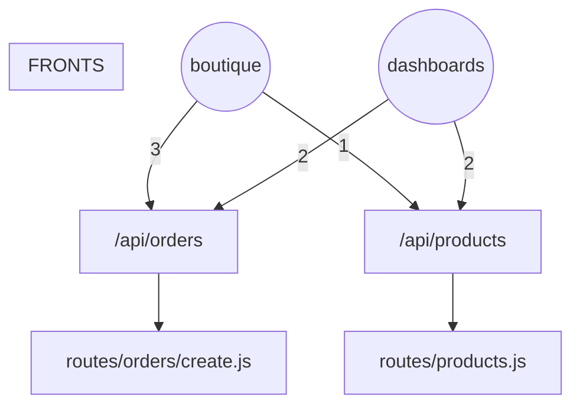

# Méta-graphe des coutures — les 3 territoires

> ⚠️ Généré par `scripts/gen-meta-graph.js`. Ne pas éditer à la main.
> Régénéré le 2026-08-11T19:49:30.507Z.
> Clé de voûte : le contrat OpenAPI. Chaque endpoint consommé est remonté
> jusqu'à sa route backend → services → tables (`x-route-file`).

## Sources cousues

- Backend : **773** nœuds · Contrat : **423** endpoints
- Boutique : **77** modules, 46 endpoints
- Dashboards : **40** modules, 111 arêtes d'appel

## Synthèse des coutures

- Endpoints consommés par au moins un front : **87**
- 🔗 Endpoints **partagés** (boutique + dashboards) : **2** — rayon de casse amplifié
- 🔴 Coutures **fantômes** (front → hors contrat) : **0**
- ⚠️ Tables touchées par **les deux** fronts : **16**

## 1. Endpoints partagés — toucher = casse double

| Endpoint | Route backend | Boutique | Dashboards | Tables |
|---|---|---|---|---|
| `/api/orders` | `routes/orders/create.js` | b-checkout, b-tracking, komerce-api | OrdersLogisticsView, ProblemsView | `orders`, `product_skus`, `product_variants`, `products`, `recipients`, `relais`, `shared_cart_items`, `shared_carts`, `cart_shares`, `order_items`, `order_status_history` |
| `/api/products` | `routes/products.js` | komerce-api | EconomicFlowView, PricingStrategyView | `product_skus`, `product_variants`, `products` |

## 3. Tables à rayon de casse maximal (lues/écrites pour les 2 fronts)

| Table | Routes | Modules boutique | Vues dashboards |
|---|---|---|---|
| `cart_shares` | 2 | 4 | 2 |
| `invoices` | 2 | 1 | 1 |
| `order_items` | 6 | 3 | 4 |
| `order_status_history` | 1 | 3 | 2 |
| `orders` | 19 | 5 | 12 |
| `parcel_items` | 4 | 1 | 3 |
| `parcels` | 10 | 2 | 9 |
| `product_skus` | 3 | 3 | 5 |
| `product_variants` | 4 | 3 | 6 |
| `products` | 11 | 4 | 9 |
| `recipients` | 1 | 3 | 2 |
| `relais` | 9 | 4 | 7 |
| `scan_events` | 3 | 1 | 3 |
| `shared_cart_items` | 1 | 3 | 2 |
| `shared_carts` | 1 | 3 | 2 |
| `users` | 10 | 7 | 6 |

## 4. Carte des coutures (partagés + fantômes)

---
*Vérifié en pre-commit par `meta:graph:check` (cliquet sur les coutures fantômes).*
